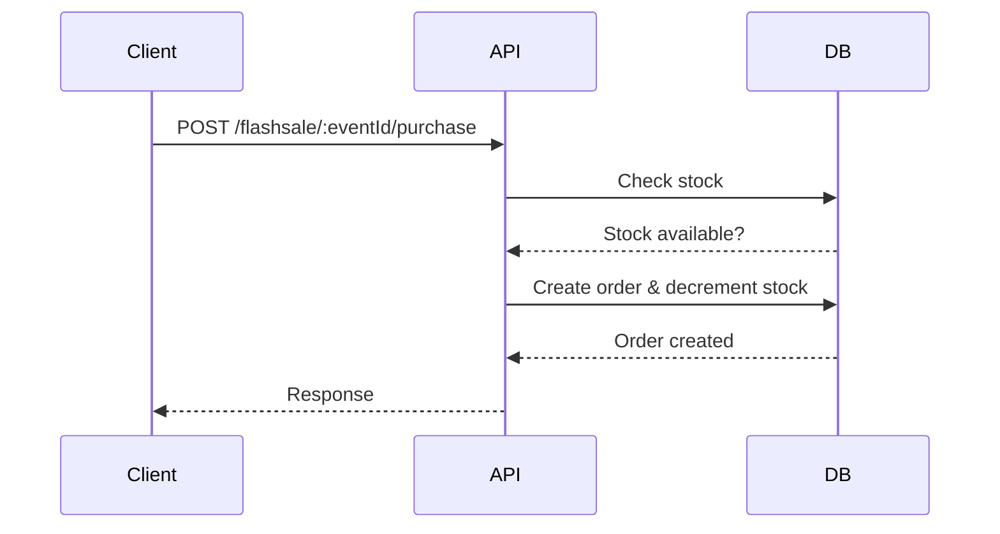
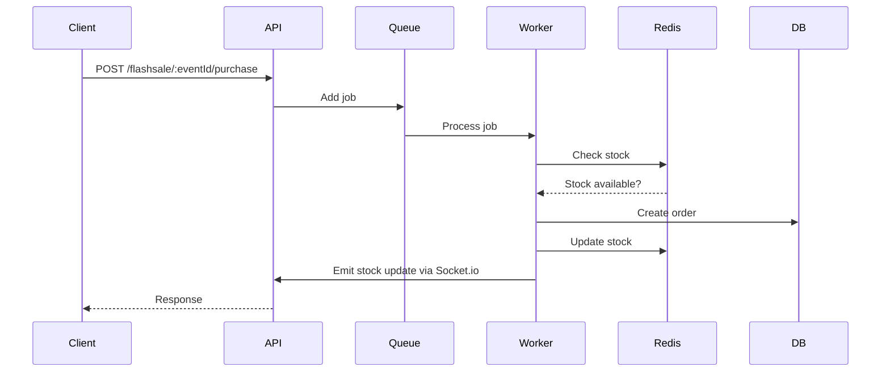
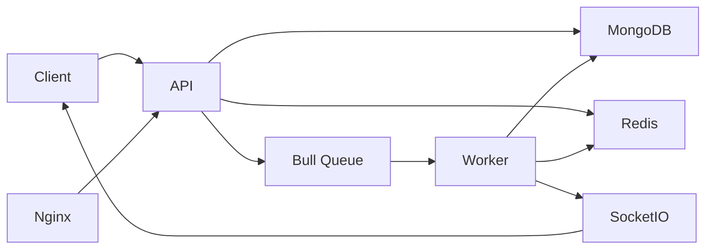

# FlashFast Backend Architecture 

## 1. Project Overview

FlashFast is a high-performance **E-Commerce Flash Sale platform** designed to handle extreme traffic spikes during flash sales. It supports:

* **V1 – Synchronous HTTP flow**: Direct request handling.
* **V2 – Asynchronous queue-based processing**: Handles high concurrency with **Bull** + Redis.

**Tech Stack**:

* Node.js (Express)
* MongoDB
* Redis + Bull
* Socket.io
* Docker Compose
* Nginx

**Highlights**:

* Real-time stock updates
* Robust concurrency control
* Horizontal scalability

---

## 2. Repository Structure

```
flashfast-backend/
├── v1/
│   ├── app.js
│   ├── controllers/
│   ├── routes/
│   ├── models/
│   ├── middlewares/
│   ├── utils/
│   ├── views/
│   ├── .env.v1
│   └── README.md
├── v2/
│   ├── app.js
│   ├── server.js
│   ├── middlewares/
│   ├── models/
│   ├── controllers/
│   ├── routes/
│   ├── queues/
│   ├── workers/
│   ├── views/
│   ├── utils/
│   │   ├── db.js
│   │   ├── redis.js
│   ├── .env.v2
│   └── README.md
├── docker-compose.yml
├── nginx.conf
├── ARCHITECTURE.md
├── ANALYSIS_REPORT.pdf
├── README.md
└── .gitignore
```

---

## 3. Core Components & Diagrams

### 3.1 API Server (Express.js)

Handles all HTTP requests and integrates middleware:

* JWT authentication
* Validation
* Error handling

**Routes:**

```js
// V1
app.use("/auth", authRoutes);
app.use("/products", productRoutes);
app.use("/flashsale-events", flashSaleEventRoutes);
app.use("/flashsale", flashSaleRoutes);
app.use("/orders", orderRoutes);

// V2
app.use("/api/flashsale-events", flashSaleEventRoutes);
app.use("/api/auth", authRoutes);
app.use("/api/products", productRoutes);
app.use("/api/flashsale", flashSaleRoutes);
app.use("/api/orders", orderRoutes);
```

### 3.2 Database (MongoDB)

* Stores: Users, Products, FlashSaleEvents, Orders
* Indexed fields: `flashSaleEventId`, `userId`, `productId`

### 3.3 Cache & Queue

* **Redis**: Live stock counters, atomic operations
* **Bull Queue**: Async job processing, sequential execution, retries, delayed jobs

### 3.4 Worker

Processes queue jobs, validates requests, updates Redis, creates orders in MongoDB, emits stock updates.

### 3.5 Real-Time Updates (Socket.io)

* `/flashsale` for stock updates
* `/announcements` for system-wide messages
* Push-based updates avoid polling

### 3.6 Load Balancer (Nginx)

* Routes requests to multiple app instances
* SSL termination
* Supports Docker Compose network

---

## 4. Data Models

#### User
```js
const userSchema = new mongoose.Schema({
  name: { type: String, required: true },
  email: { type: String, required: true, unique: true },
  password: { type: String, required: true },
  role: { type: String, enum: ['customer', 'admin'], default: 'customer' },
});
```

#### Product
```js
const productSchema = new mongoose.Schema({
  name: { type: String, required: true },
  price: { type: Number, required: true },
  stock: { type: Number, required: true, default: 0 },
  image: { type: String },
}, { timestamps: true });
```

#### FlashSaleEvent
```js
const flashSaleEventSchema = new mongoose.Schema({
  product: { type: mongoose.Schema.Types.ObjectId, ref: 'Product', required: true },
  startTime: { type: Date, required: true },
  endTime: { type: Date, required: true },
  availableStock: { type: Number, required: true, min: 0 },
  soldQuantity: { type: Number, default: 0, min: 0 },
  isActive: { type: Boolean, default: true, index: true },
}, { timestamps: true });
```

#### Order
```js
const orderSchema = new mongoose.Schema({
  user: { type: mongoose.Schema.Types.ObjectId, ref: 'User', required: true },
  product: { type: mongoose.Schema.Types.ObjectId, ref: 'Product', required: true },
  quantity: { type: Number, required: true },
  status: { type: String, enum: ['confirmed', 'failed'], default: 'confirmed' },
  totalPrice: { type: Number, required: true },
  createdAt: { type: Date, default: Date.now },
}, { timestamps: true });
```
---

## 5. System Flow Diagrams

### 5.1 V1 – Synchronous Flow



### 5.2 V2 – Asynchronous Queue Flow



### 5.3 Real-Time Stock Updates


### 5.4 Full Component Interaction



---

## 6. Performance & Scalability

* Queue system (V2) prevents overselling
* Redis counters reduce DB load
* Socket.io push updates
* Docker + Nginx horizontal scaling
* MongoDB indexing optimized

---

## 7. Security & Best Practices

* JWT authentication
* Input validation
* Rate limiting
* Atomic Redis stock operations
* Worker retries and dead-letter handling

---

## 8. Deployment Considerations

* Docker Compose for environment setup
* Separate env files for V1 and V2
* Nginx reverse proxy for load balancing
* Multiple API + Worker instances
* Monitoring queue and worker health

---

## 9. Conclusion

FlashFast provides high-concurrency flash sale capabilities. V1 is synchronous; V2 is scalable, asynchronous, and real-time, ensuring stock consistency and high performance.

*All diagrams use Mermaid syntax and are fully renderable on GitHub.*
